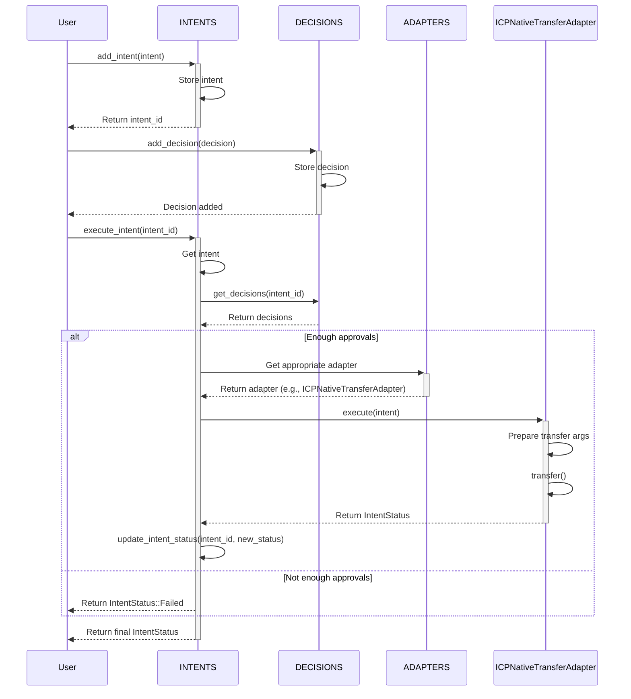

# multisignature
A cross-chain decentralized multisignature wallet.

## Prerequisites
* [Tsc compiler](https://www.typescriptlang.org/download/) 
* [Rust (using rustup)](https://www.rust-lang.org/tools/install)
* [DFX command-line tool](https://internetcomputer.org/docs/current/developer-docs/getting-started/install/#installing-dfx-via-dfxvm)

## Installation
1. Clone the repository:
   ```
   git clone git@github.com:keygate-vault/multisignature.git
   ```
2. Install frontend dependencies via NPM:
   ```
   npm install
   ```
3. Run the deployment script:
   ```
   ./deployment.sh
   ```

## Architecture


**Ledger canister**: Imported from the existing DFINITY native ICP ledger through `dfx.json`. Used to fetch the ICP balance of a smart account.

**Dashboard canister** (`dash`): Provides the user interface for interacting with the multisignature wallet.

**Account canister**: Manages the multisignature wallet functionality, including transaction creation, approval, and execution.

## Logic


## Useful commands

Send ICRC1 tokens to a vault.
```
dfx canister call icrc1_ledger_canister icrc1_transfer '(
  record {
    from_subaccount = null;
    to = record {
      owner = principal "avqkn-guaaa-aaaaa-qaaea-cai"
    };
    amount = 200_000_000_000;
    fee = opt 0;        
    memo = null;
    created_at_time = null;
  }
)'
```

Request ICRC1 balance of a principal.
```
dfx canister call icrc1_ledger_canister icrc1_balance_of '(
  record {
    owner = principal "avqkn-guaaa-aaaaa-qaaea-cai";
    subaccount = null;
  }
)'
```

