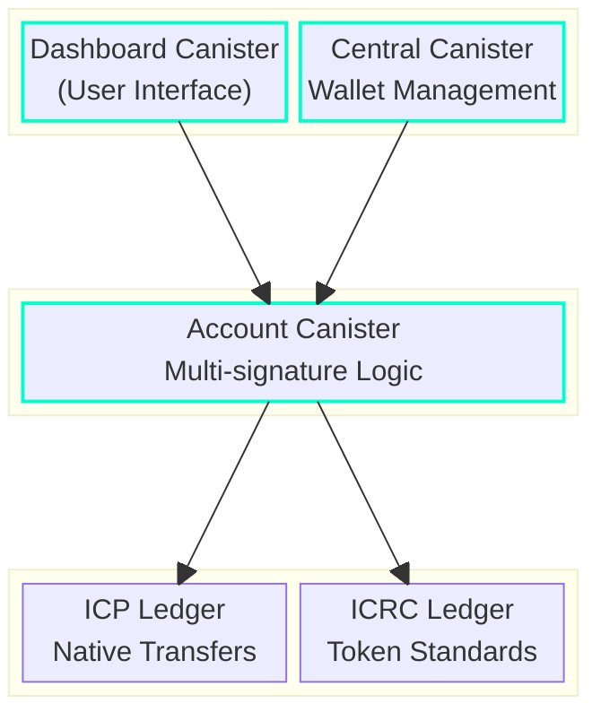

> This project is **still in Beta**. We are happy to answer questions if they are raised as issues in this github repo.

[](https://internetcomputer.org)
[](LICENSE)
[](./actions/workflows/tests.yaml)


# Keygate Vault

A cross-chain decentralized multisignature platform built for the Internet Computer Protocol (ICP). Keygate simplifies the management of multi-party digital assets by providing a secure, flexible, and user-friendly infrastructure for creating and managing multisignature wallets.

## Overview

Keygate is an innovative multisignature platform built natively for the Internet Computer Protocol (ICP) with cross-chain capabilities. Inspired by traditional banking's multi-approval systems, Keygate aims to bring enterprise-grade security and flexibility to digital asset management, enabling both individuals and organizations to manage their assets with customizable approval workflows.

## Vision

Our vision with Keygate is to democratize institutional-grade digital asset management. The multisignature wallet is our flagship application, demonstrating the potential of ICP's secure architecture while providing essential functionality for multi-party asset management. The core of our innovation lies in the platform's flexibility, which enables users to create anything from simple dual-signature wallets to complex enterprise approval systems.

## System Architecture



## Components

- **Dashboard Canister**: The main interface for users to interact with their multisignature wallets. Handles user management, transaction visualization, and approval workflows.
- **Central Canister**: Manages wallet deployment and upgrades. Controls the lifecycle of account canisters.
- **Account Canister**: The core multisignature implementation. Handles transaction proposals, approvals, and execution.
- **Ledger Integration**: Native support for both ICP and ICRC token standards.

## Build and Deploy

### Requirements

Please make sure you have the following installed:

- [TypeScript Compiler (tsc)](https://www.typescriptlang.org/download/)
- [Rust](https://www.rust-lang.org/tools/install)
- [DFX](https://internetcomputer.org/docs/current/developer-docs/getting-started/install/#installing-dfx-via-dfxvm)

### Quick Start

1. Clone and setup:
   ```bash
   git clone git@github.com:keygate-vault/multisignature.git
   cd multisignature
   npm install
   ```

2. Deploy locally:
   ```bash
   dfx start --clean --background
   ./deployment.sh
   ```

### Development Commands

Test ICP transfers:
```bash
dfx ledger transfer <vault_account_id> --amount 100 --memo 1 --network local --identity minter --fee 0
```

Test ICRC1 operations:
```bash
# Transfer
dfx canister call icrc1_ledger_canister icrc1_transfer '(
  record {
    from_subaccount = null;
    to = record {
      owner = principal "avqkn-guaaa-aaaaa-qaaea-cai"
    };
    amount = 200_000_000_000;
    fee = opt 0;        
    memo = null;
    created_at_time = null;
  }
)'

# Check balance
dfx canister call icrc1_ledger_canister icrc1_balance_of '(
  record {
    owner = principal "avqkn-guaaa-aaaaa-qaaea-cai";
    subaccount = null;
  }
)'
```

## Security Features

- Multi-layer approval system
- Customizable transaction thresholds
- Secure canister architecture
- Comprehensive transaction logging
- Identity-based access control

## Roadmap

- [x] Basic multisignature functionality
- [x] ICP and ICRC1 support
- [X] Ethereum L1 and L2 support
- [ ] Additional blockchain integrations
- [ ] Advanced approval workflows
- [ ] Hardware wallet support
- [ ] Mobile application

## Contributing

This project is currently in beta and welcomes contributions. Please read our [Contributing Guidelines](CONTRIBUTING.md) before submitting pull requests.

## Show your support

If you find this project valuable, please give it a star ⭐️

Your support motivates us to continue improving the platform and bringing institutional-grade security to digital asset management.
