# Keygate Multisignature Wallet

A secure, cross-chain decentralized multisignature wallet built on the Internet Computer Protocol (ICP). This system enables multiple parties to jointly manage digital assets with customizable approval thresholds and cross-chain compatibility.

## Features

- **Multi-Chain Support**: Native support for ICP with extensible architecture for other blockchains
- **Flexible Signing Rules**: Customizable threshold for transaction approvals
- **Secure Architecture**: Decentralized design with canister-based security
- **Multiple Wallet Types**: Support for both ICRC1 and native ICP transactions
- **User-Friendly Interface**: Web-based dashboard for easy wallet management
- **Transaction Monitoring**: Real-time tracking of transaction status and approvals

## Prerequisites

Before you begin, ensure you have the following installed:

* [TypeScript Compiler (tsc)](https://www.typescriptlang.org/download/) - For frontend development
* [Rust Toolchain](https://www.rust-lang.org/tools/install) - Via rustup, for canister development
* [DFX](https://internetcomputer.org/docs/current/developer-docs/getting-started/install/#installing-dfx-via-dfxvm) - DFINITY's command-line tool for Internet Computer development
* [Node.js](https://nodejs.org/) (v14 or higher)
* [Git](https://git-scm.com/downloads)

## Quick Start

1. Clone the repository:
   ```bash
   git clone git@github.com:keygate-vault/multisignature.git
   cd multisignature
   ```

2. Install dependencies:
   ```bash
   npm install
   ```

3. Deploy the system:
   ```bash
   ./deployment.sh
   ```

## System Architecture

The system consists of three main components working together to provide secure multisignature functionality:

```mermaid
sequenceDiagram
    participant User as User 🧑
    participant Dashboard as Dashboard Canister 🖥️
    participant Account as Account Canister 🏦
    participant Ledger as Ledger Canister 💰
    
    rect rgb(240, 245, 255)
        Note over User,Ledger: Transaction Initiation
        User->>+Dashboard: Propose Transaction
        Dashboard->>Account: Create Transaction Intent
        Account-->>Dashboard: Return Intent ID
        Dashboard-->>-User: Show Pending Status
    end
    
    rect rgb(255, 245, 240)
        Note over User,Ledger: Approval Process
        User->>+Account: Submit Approval
        Account->>Account: Verify Signer
        Account->>Account: Update Approvals
        Account-->>-User: Confirmation
    end
    
    rect rgb(240, 255, 245)
        Note over User,Ledger: Execution
        User->>+Account: Execute Transaction
        Account->>Account: Check Threshold
        Account->>Ledger: Process Transfer
        Ledger-->>Account: Confirm Transfer
        Account-->>-User: Final Status
    end
```



### Components

1. **Ledger Canister**
   - Core DFINITY native ICP ledger integration
   - Handles actual token transfers
   - Manages balance tracking

2. **Dashboard Canister** (`dash`)
   - User interface for wallet interaction
   - Transaction proposal and monitoring
   - Approval management interface

3. **Account Canister**
   - Core multisignature functionality
   - Transaction proposal handling
   - Approval tracking and threshold management
   - Cross-chain adapter management

## Development Guide

### Local Development Setup

1. Start the local Internet Computer replica:
   ```bash
   dfx start --clean --background
   ```

2. Deploy the canisters:
   ```bash
   dfx deploy
   ```

3. Start the development server:
   ```bash
   npm start
   ```

### Testing

Run the test suite:
```bash
dfx test
npm test
```

## Usage Examples

### Managing Wallets

1. Create a new wallet:
   ```bash
   dfx canister call account_canister deploy_account '(record { name = "My Wallet" })'
   ```

2. Add a signer:
   ```bash
   dfx canister call account_canister add_signer '(principal "<PRINCIPAL_ID>")'
   ```

3. Set approval threshold:
   ```bash
   dfx canister call account_canister set_threshold '(2)'
   ```

### Transaction Management

#### ICRC1 Token Operations

Send ICRC1 tokens to a vault:
```bash
dfx canister call icrc1_ledger_canister icrc1_transfer '(
  record {
    from_subaccount = null;
    to = record {
      owner = principal "avqkn-guaaa-aaaaa-qaaea-cai"
    };
    amount = 200_000_000_000;
    fee = opt 0;        
    memo = null;
    created_at_time = null;
  }
)'
```

Check ICRC1 balance:
```bash
dfx canister call icrc1_ledger_canister icrc1_balance_of '(
  record {
    owner = principal "avqkn-guaaa-aaaaa-qaaea-cai";
    subaccount = null;
  }
)'
```

#### ICP Operations

Send ICP to a vault:
```bash
dfx ledger transfer <vault_account_id> --amount 100 --memo 1 --network local --identity minter --fee 0
```

## Security Considerations

- Always verify transaction details before approval
- Keep private keys secure and never share them
- Regularly audit the list of approved signers
- Test threshold changes with small transactions first
- Monitor transaction logs for suspicious activity

## Contributing

1. Fork the repository
2. Create your feature branch: `git checkout -b feature/AmazingFeature`
3. Commit your changes: `git commit -m 'Add AmazingFeature'`
4. Push to the branch: `git push origin feature/AmazingFeature`
5. Open a Pull Request
